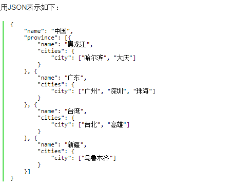
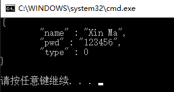

# JSON #
JSON(JavaScript Object Notation, JS 对象简谱) 是一种轻量级的数据交换格式。它基于 ECMAScript (欧洲计算机协会制定的js规范)的一个子集，采用完全独立于编程语言的文本格式来存储和表示数据。简洁和清晰的层次结构使得 JSON 成为理想的数据交换语言。 易于人阅读和编写，同时也易于机器解析和生成，并有效地提升网络传输效率。

## **JSON 语法规则** ##

对象表示为键值对

数据由逗号分隔

花括号保存对象

方括号保存数组

## **JSON 键/值对** ##

SON 键值对是用来保存 JS 对象的一种方式，和 JS 对象的写法也大同小异，键/值对组合中的键名写在前面并用双引号 "" 包裹，使用冒号 : 分隔，然后紧接着值：

	{"firstName": "Json"}
这很容易理解，等价于这条 JavaScript 语句：
	{firstName : "Json"}

## **JSON 和 JS 对象互转** ##
要实现从JSON对象转换为JS字符串，使用 JSON.parse() 方法：

	var obj = JSON.parse('{"a": "Hello", "b": "World"}'); //结果是 {a: 'Hello', b: 'World'}
要实现从JS对象转换为JSON字符串，使用 JSON.stringify() 方法：

	var json = JSON.stringify({a: 'Hello', b: 'World'}); //结果是 '{"a": "Hello", "b": "World"}'

## **常用类型编辑** ##

在 JS 语言中，一切都是对象。因此，任何支持的类型都可以通过 JSON 来表示，例如字符串、数字、对象、数组等。但是对象和数组是比较特殊且常用的两种类型。

对象：对象在 JS 中是使用花括号包裹 {} 起来的内容，数据结构为 {key1：value1, key2：value2, ...} 的键值对结构。在面向对象的语言中，key 为对象的属性，value 为对应的值。键名可以使用整数和字符串来表示。值的类型可以是任意类型。

数组：数组在 JS 中是方括号 [] 包裹起来的内容，数据结构为 ["java", "javascript", "vb", ...] 的索引结构。在 JS 中，数组是一种比较特殊的数据类型，它也可以像对象那样使用键值对，但还是索引使用得多。同样，值的类型可以是任意类型。

## 基础示例 ##
**表示对象**

JSON最常用的格式是对象的 键值对。例如下面这样：

	{"firstName": "Brett", "lastName": "McLaughlin"}

表示数组
和普通的 JS 数组一样，JSON 表示数组的方式也是使用方括号 []。

    {
     
     
    "people":[
     
     
    {
     
    "firstName": "Brett",
     
    "lastName":"McLaughlin"
     
    },
     
     
    {
     
    "firstName":"Jason",
     
    "lastName":"Hunter"
     
     
    }
     
     
     
    ]
     
    }
这不难理解。在这个示例中，只有一个名为 people的变量，值是包含两个条目的数组，每个条目是一个人的记录，其中包含名和姓。上面的示例演示如何用括号将记录组合成一个值。当然，可以使用相同的语法表示更过多的值（每个值包含多个记录）。

    //Examples:
    Json::Value null_value; // null
    Json::Value arr_value(Json::arrayValue); // []
    Json::Value obj_value(Json::objectValue); // {}
    

json使用方法 
	
	https://blog.csdn.net/yc461515457/article/details/52749575

JSON 是一种轻量级的数据交换格式。JSON对象表示为键值对。                         

 实践JSON相关对象的成员函数 .parse(),.toStyledString()等方法进行JSON对象的操作

相关例子：

    #include"json\json.h"
    #include<iostream>
    #include<string>
    using namespace std;
    
    //定义jsoncpp 支持的对象类型
    enum Type
    {
    	nullValue = 0, ///< 'null' value
    	intValue,  ///< signed integer value
    	uintValue, ///< unsigned integer value
    	realValue, ///< double value
    	stringValue,   ///< UTF-8 string value
    	booleanValue,  ///< bool value
    	arrayValue,///< array value (ordered list)
    	objectValue///< object value (collection of name/value pairs).
    };
    
    int main()
    {
    	Json::Value root;
    	root["type"] = nullValue;
    	root["name"] = "Xin Ma";
    	root["pwd"] = "123456";
    	
    
    	string tmpstr = root.toStyledString();
    	string tmpstr_name = root["name"].asString();//这种方法可以将json的键值对转换成字符串
    	cout << tmpstr << endl;
    	cout << tmpstr_name.length() << endl;
    	cout << tmpstr_name + " is online " << endl;
    
    	cout << root["name"]<<tmpstr.c_str() << endl;//.c_str()方法也可以将Json字符串转化为char* 类型，一般以后发送消息都是通过这种方式
    
    	//string tmpstr_asString = root.asCString();//这样不行
    	
    	//字符串方式转化为json对象 通过reader将char转化为json对象root1
    	const char* str = "{ \"uploadid\": \"UP000000\",\"code\": 100,\"msg\": \"\",\"files\": \"\" }";
    	Json::Reader reader;
    	Json::Value root1;
    	reader.parse(str, root1);
    	string tmpstr1 = root1.toStyledString();
    	cout << tmpstr1 << endl;
    
    	//char buff[1024] = { 0 };
    	//(buff, strlen(tmpstr.c_str()) + 1, tmp.c_str());
    	return 0;
    }

