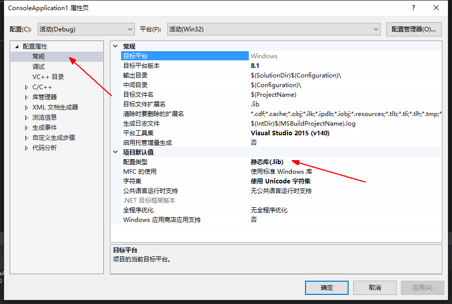
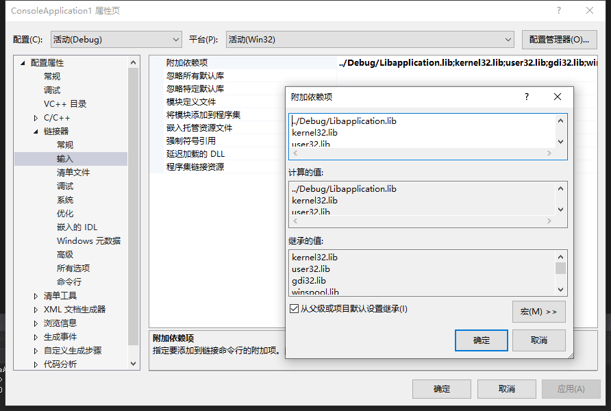
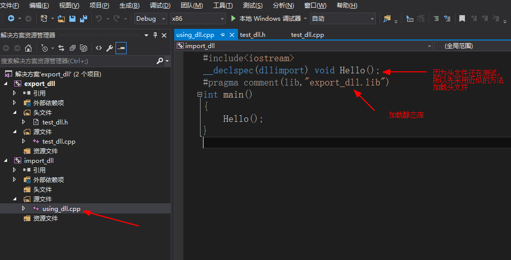

# VS生成、使用dll，lib文件 #

一般来说项目偏爱生成dll动态库文件，因为可以解决静态库造成的空间浪费和更新困难问题

## 什么是库 ##

**库是写好的现有的，成熟的，可以复用的代码。**现实中每个程序都要依赖很多基础的底层库，不可能每个人的代码都从零开始，因此库的存在意义非同寻常。本质上来说库是一种可执行代码的二进制形式，可以被操作系统载入内存执行。库有两种：静态库（.a、.lib）和动态库（.so、.dll）。

所谓静态、动态是指链接。回顾一下，将一个程序编译成可执行程序的步骤：

## 静态库 ##

之所以称为【静态库】，**是因为在链接阶段**，**会将汇编生成的目标文件.o与引用到的库一起链接打包到可执行文件中**。因此对应的链接方式称为静态链接。

试想一下，静态库与汇编生成的目标文件一起链接为可执行文件，那么静态库必定跟.o文件格式相似。其实一个静态库可以简单看成是一组目标文件（.o/.obj文件）的集合，即很多目标文件经过压缩打包后形成的一个文件。

**静态库优缺点总结：**

1. 静态库对函数库的链接是放在编译时期完成的。

2. 程序在运行时与函数库再无瓜葛，移植方便。

3. 浪费空间和资源，因为所有相关的目标文件与牵涉到的函数库被链接合成一个可执行文件。

## 创建静态库（.lib） ##

　　**创建静态库有两种方法。**

1.创建项目时进行设置

创建win32控制台程序时，勾选静态库类型（下面的预编译等选项可选可不选）；打开工程“属性面板”-”配置属性”-”常规”，配置类型选择静态库。

2.生成项目时进行设置

创建空项目之后，生成项目时，选择项目-属性-配置属性-常规-项目默认值-配置类型-选择生成静态库lib。程序编译通过后，Build项目即可生成静态库。即可生成.lib，输出栏会显示出静态库的位置。

## 使用静态库 ##

## 测试一：我们先在一个解决方案下面建立两个项目 ，并且有头文件的方式##
**文件关系为：**

代码分别为：

**生成上面的项目后得到.lib文件，新项目里面调用.lib**

## [重要]注意，头文件很重要，在目标文件调用库文件之前，一定需要调用头文件 ##
**调用方法一：**

1.将lib拷贝至目标编译程序的文件夹下

2.在输入里面添加库名(注意正确写库名，一般库名是项目名而不是某个程序名)

**调用方法二：(推荐,标准写法)**
1.直接输入语句`#pragma comment(lib,"../debug/Libapplication.lib")`

注：根据目前公司的写法建议将.h写在include里面，将通用的代码写在src里面，将各个平台的中间编译文件写在project的各个平台下面

建议：直接将头文件和库文件拷贝到src_code源代码所在的文件夹下面,目前的解决方案

**调用方法三：**

不移动库而是相对当前的项目文件夹写出lib库的位置

**调用方法四：**

利用相对路径在链接器-输入里面写入lib库的位置`$(OutputPath)Libapplication.lib`

## 小贴士： ##
从上面可以看出我们的lib项目里的testlib.cpp是cpp文件，即C++文件。

如果我们把testlib.cpp改成testlib.c的话，这时候重新编译lib工程，然后运行TestApp，

会出现如下错误：

有时候，可能因为某种原因，lib文件必须是C语言，那么该怎么解决？

这时候，我们需要更改我们TestLib.h这个文件。

    #pragma once
     
    #ifdef __cplusplus
    extern"C" {
    #endif

    	void HelloWorld();
    
    #ifdef __cplusplus
    }
    #endif

为了在C++代码中调用用C写成的库文件，就需要用extern"C"来告诉编译器:这是一个用C写成的库文件，请用C的方式来链接它们。
这样重新编译我们的Testlib.lib后，再次运行TestApp就可以了。

被extern "C"修饰的变量和函数是按照C语言方式进行编译和链接的：这点很重要！！！！

## 介绍一下标准头文件的结构： ##

    #ifndef __INCvxWorksh /*防止该头文件被重复引用*/
    
    #define __INCvxWorksh
    
    #ifdef __cplusplus //告诉编译器，这部分代码按C语言的格式进行编译，而不是C++的
    
    extern "C"{
    
    #endif
    
    /*…*/
    
    #ifdef __cplusplus
    
    }
    
    #endif
    
    #endif /*end of __INCvxWorksh*/

## 动态库 ##

通过上面的介绍发现静态库，容易使用和理解，也达到了代码复用的目的，那为什么还需要动态库呢？为什么需要动态库，其实也是静态库的特点导致。

1.空间浪费是静态库的一个问题。

2.另一个问题是静态库对程序的更新、部署和发布也会带来麻烦。如果静态库lib更新了，**所有使用它的应用程序都需要重新编译、发布给用户**（对于玩家来说，可能是一个很小的改动，却导致整个程序重新下载，全量更新）。

**1.动态库在程序编译时并不会被连接到目标代码中，而是在程序运行时才被载入**。

**2.不同的应用程序如果调用相同的库，那么在内存里只需要有一份该共享库的实例，规避了空间浪费问题。**

**3.动态库在程序运行时才被载入，也解决了静态库对程序的更新、部署和发布页会带来麻烦。用户只需要更新动态库即可，增量更新。**

**动态库特点总结：**

1.动态库把对一些库函数的链接载入推迟到程序运行的时期。

2.可以实现进程之间的资源共享。（因此动态库也称为共享库）

3.将一些程序升级变得简单。

4.甚至可以真正做到链接载入完全由程序员在程序代码中控制（显示调用）。

## 动态库的生成和使用 ##

1.首先在解决方案下面创建一个dll项目（这里使用了导出符号和预编译头，只要选了导出符号就会自动生成预编译头，不管勾选与否）

2.主要的文件结构

3.主要的头文件

4.主要函数

5.右键项目-生成以后会生成.lib和.dll

6.会在debug文件夹下面生成

StaticLibrary.lib的大小为190KB，DynamicLibrary.lib的大小为3KB，**静态库对应的lib文件叫静态库**，**动态库对应的lib文件叫导入库**。实际上静态库本身就包含了实际执行代码、符号表等等，而对于导入库而言，其实际的执行代码位于动态库中，导入库只包含了地址符号表等，确保程序找到对应函数的一些基本地址信息。

7.新建一个项目**并设置为启动项**

8.先将头文件和.lib加入,然后生成

9.生成结果

10.注：

为什么要使用`__declspec(dllexport)与__declspec(dllimport)`，及两者的区别：都是DLL内的关键字，即导出与导入。他们是将DLL内部的类与函数以及数据导出与导入时使用的。主要区别在于，dllexport是在这些类、函数以 及数据的申明的时候使用。用过表明这些东西可以被外部函数使用，即**（dllexport）是把DLL中的相关代码（类，函数，数据）暴露出来为其他应用程 序使用**。使用了（dllexport）关键字，相当于声明了紧接在（dllexport）关键字后面的相关内容是可以为其他程序使用的。而 dllimport关键字是在外部程序需要使用DLL内相关内容时使用的关键字。当一个外部程序要使用DLL内部代码（类，函数，全局变量）时，只需要在 程序内部使用（dllimport）关键字声明需要使用的代码就可以了，即**（dllimport）关键字是在外部程序需要使用DLL内部相关内容的时候才使用**。（dllimport）作用是把DLL中的相关代码插入到应用程序中。**如果没有使用dllexport导出函数，将无法生成lib文件，只能生成dll文件**。

## 11.以空项目形式导出和使用dll ##
1.以空项目形式生成

2.头文件写法

3.实现程序写法

4.右键项目-生成，生成.dll(动态库) .lib（导入库）

5.使用.dll,将.h和.lib复制黏贴到目标项目下面（.dll因为是在同一个解决方案debug文件夹下已经生成了，如果在不同解决方案，就应该复制到新的解决方案下面的debug文件夹）

## 6.使用define宏定义[重要] ##
定义头文件上的`__declspec(dllexport)和__declspec(dllimport)`，
VS2015里，项目属性->配置属性->C/C++->预处理器->预处理器定义。（需要在新建一个c/c++文件之后才能看到）

移动.h和.lib

.dll放在外层解决方案的debug中

头文件添加现有项，库文件#pragma comment(lib,"")加载

如果是将dll用于另外的解决方案的话，把.dll .lib .h都放在一个文件夹下面 ，添加.lib和.h，msvc会自动调用dll文件

注：关于c生成dll动态库

关于C和C++的兼容问题
 
如果要写C和C++兼容的DLL，因为在C和C++下使用了不同的名字修饰规则以及不同的调用约定，所以，**如果DLL是用C编写和编译的，则在用于C++模块时，函数的声明前应加上extern “C”关键字**，**以告诉LINKER使用C外部连接**（即按照C名字修饰规则在外部模块中寻找函数）；反之，**如果DLL是用C++编写和编译的，则在用于C模块时，函数的声明前要加上extern “C++”关键字**。VC++通过`_cplusplus`宏来标识C++程式。如果是C++程式，VC编译器就会为你定义_cplusplus宏。所以在DLL中可以使用如下的技术来解决兼容问题：
 
    #ifdef _cplusplus
     
    extern “C” {
     
    #endif
     
    // 将所有的函数声明放在这里
     
    #ifdef _cplusplus
     
    }
     
    #endif

