# Linux下的静态库与动态库生成与使用 #
linux下的静态库和动态库都是由.o文件生成的

**静态库** 

静态库文件名的命名方式是“libxxx.a”,库名前加”lib”，后缀用”.a”，“xxx”为静态库名。 

链接时间： 静态库的代码是在编译过程中被载入程序中。 

链接方式：静态库的链接是将整个函数库的所有数据都整合进了目标代码。这样做优点是在编译后的执行程序不在需要外部的函数库支持，因为所使用的函数都已经被编进去了。缺点是，如果所使用的静态库发生更新改变，你的程序必须重新编译。

**动态库** 
动态库的命名方式与静态库类似，前缀相同，为“lib”，后缀变为“.so”。所以为“libmytime.so” 

链接时间：动态库在编译的时候并没有被编译进目标代码，而是当你的程序执行到相关函数时才调用该函数库里的相应函数。这样做缺点是因为函数库并没有整合进程序，所以程序的运行环境必须提供相应的库。优点是动态库的改变并不影响你的程序，所以动态函数库升级比较方便。

它们两个还有很明显的不同点：当同一个程序分别使用静态库，动态库两种方式生成两个可执行文件时，静态链接所生成的文件所占用的内存要远远大于动态链接所生成的文件。（因为静态链接是在编译时将所有的函数都编译进了程序。而动态链接是在运行是才调用库里相应函数）

**静态链接库的一个缺点是，如果我们同时运行了许多程序，并且它们使用了同一个库函数，这样，在内存中会大量拷贝同一库函数。这样，就会浪费很多珍贵的内存和存储空间。使用了共享链接库的Linux就可以避免这个问题。**

## 静态库的生成与使用 ##
**1.文件结构**

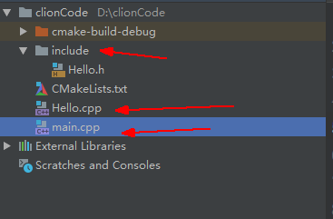

**2.文件代码**

头文件Hello.h

    #ifndef CLIONCODE_HELLO_H
    #define CLIONCODE_HELLO_H
    void Hello();
    #endif //CLIONCODE_HELLO_H

实现文件Hello.cpp

    #include "./include/Hello.h"
    #include <iostream>
    
    void Hello() {
    	std::cout << "hello this is lib" << std::endl;
    }

主程序main.cpp

	#include <iostream>
	#include "./include/Hello.h"
	int main() {
	    Hello();
	}

**3.操作过程**

首先现在Clion下面用WSL编译环境跑一边上面的程序，能够编译通过后，将它们由SSH拷贝在WSL下，形成这样的结构(.o .a是后来运行出来的先不用管)

**4.shell命令**

**生成.a静态库**

首先使用`g++ -c -o Hello.o Hello.cpp`，因为无论静态库还是动态库都是由.o文件生成的，所以将Hello.cpp通过 -c的方式编译成Hello.o（编译汇编成目标代码而不链接）

接着使用`ar cr libHello.a Hello.o`，生成静态库libHello.a（注意：静态库文件的生成名称由讲究，必须是lib+文件名）

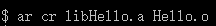

**使用.a静态库**

使用`g++ -o main main.cpp -static -lHello -L.`将静态库编译进去 

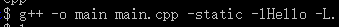

-static :表示程序的静态链接

-lHello：链接静态库Hello.a

-L. :链接时需指明静态库所存在的路径，‘.’表示当前路径

生成的文件

**运行./main**

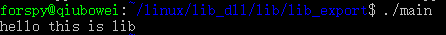

（静态库是在编译阶段就进入然后链接成为可执行代码，所以删掉libHello.a并不会影响main的运行结果）

## 动态库的生成与使用 ##

最主要的是GCC命令行的一个选项: 
-shared 该选项指定生成动态连接库（让连接器生成T类型的导出符号表，有时候也生成弱连接W类型的导出符号），不用该标志外部程序无法连接。相当于一个可执行文件 
-fPIC：表示编译为位置独立的代码，不用此选项的话编译后的代码是位置相关的所以动态载入时是通过代码拷贝的方式来满足不同进程的需要，而不能达到真正代码段共享的目的。（转者注：共享库各段的加载地址并没有定死，可以加载到任意位置，因为指令中没有使用绝对地址（相对于链接后的可执行文件各segment来说），因此称为位置无关代码） 
-L.：表示要连接的库在当前目录中 
-ltest：编译器查找动态连接库时有隐含的命名规则，即在给出的名字前面加上lib，后面加上.so来确定库的名称

## 生成动态库 ##

1.生成.o文件 

    g++ -c -o Hello.o Hello.cpp -fpic  
或者**正规写法** `g++ -c -shared -fPIC -o Hello.o Hello.cpp`
注意这里在生成.o文件的时候先使用 -fpic （动态连接库中用到的object文件必须是用 "-fPIC"选项编译产生的，否则连接时要么报错，要么被忽略。）

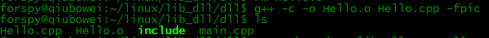
或

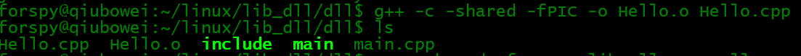
2.生成.so动态库文件

	g++ -shared -o libHello.so Hello.o   
这样**正规写法**也行

	g++ -fpic -shared -o libHello.so Hello.o
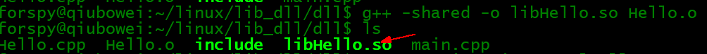

简便写法：

	g++ -fpic -shared -o libHello.so Hello.cpp

## 重要知识点： ##

1.当一个程序使用共享函数库时，在连接阶段并不把函数代码连接进来，而只是链接函数的一个引用。当最终的函数导入内存开始真正执行时，函数引用被解析，共享函数库的代码才真正导入到内存中。这样，共享链接库的函数就可以被许多程序同时共享，并且只需存储一次就可以了。共享函数库的另一个优点是，它可以独立更新，与调用它的函数毫不影响。

2.“PIC”命令行标记告诉GCC产生的代码不要包含对函数和变量具体内存位置的引用，这是因为现在还无法知道使用该消息代码的应用程序会将它连接到哪一段内存地址空间。这样编译出的add.c可以被用于建立共享链接库。建立共享链接库只需要用GCC的”-shared”标记即可。
## 使用动态库 ##

1.链接并使用动态库
	g++ -o main main.cpp -lHello -L.

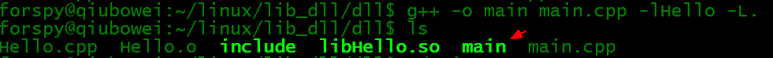

链接使用的方式和静态库一致  -lHello 表示链接 libHello.so   
-L.表示在当前路径下寻找库(当同时有动态和静态库时，优先链接动态库)

2.运行链接后的./main 

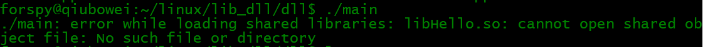
报错：

	./main: error while loading shared libraries: libHello.so: cannot open shared object file: No such file or directory

3.修正

因为进行动态链接时，程序并不会在当前目录中寻找动态库，而是会在/usr/lib目录下寻找，所以我们将动态库libHello.so移动到/usr/lib下就可以了。（在root权限下）

这里使用的是cp  `sudo cp libHello.so /usr/lib`，mv也行`sudo mv libHello.so /usr/lib`

既然连接器会搜寻`LD_LIBRARY_PATH`所指定的目录，那么我们可以将这个环境变量设置成当前目录：
**[慎用]** `export LD_LIBRARY_PATH=$(pwd)`

4.运行

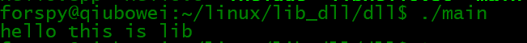

5.比较文件大小
使用ls -lh main 

**动态库生成的可执行文件大小**8.5K

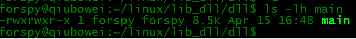

**静态库生成的可执行文件大小**2.2M 远远大于动态库的可执行文件(libHello.so也只有8.4K)

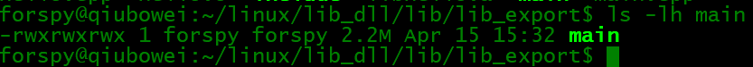

附：

**查看动态库的调用过程：**
ldd main

		linux-vdso.so.1 (0x00007fffe6d56000)
        libHello.so => /usr/lib/libHello.so (0x00007f8b58e00000)
        libstdc++.so.6 => /usr/lib/x86_64-linux-gnu/libstdc++.so.6 (0x00007f8b58a70000)
        libc.so.6 => /lib/x86_64-linux-gnu/libc.so.6 (0x00007f8b58670000)
        libm.so.6 => /lib/x86_64-linux-gnu/libm.so.6 (0x00007f8b582d0000)
        /lib64/ld-linux-x86-64.so.2 (0x00007f8b59400000)
        libgcc_s.so.1 => /lib/x86_64-linux-gnu/libgcc_s.so.1 (0x00007f8b580b0000)

部分编译参数：

-lHello：编译器查找动态连接库时有隐含的命名规则，即在给出的名字前面加上lib，后面加上.so来确定库的名称

`LD_LIBRARY_PATH`：这个环境变量指示动态连接器可以装载动态库的路径。

## shell命令生成和使用lib/dll ##
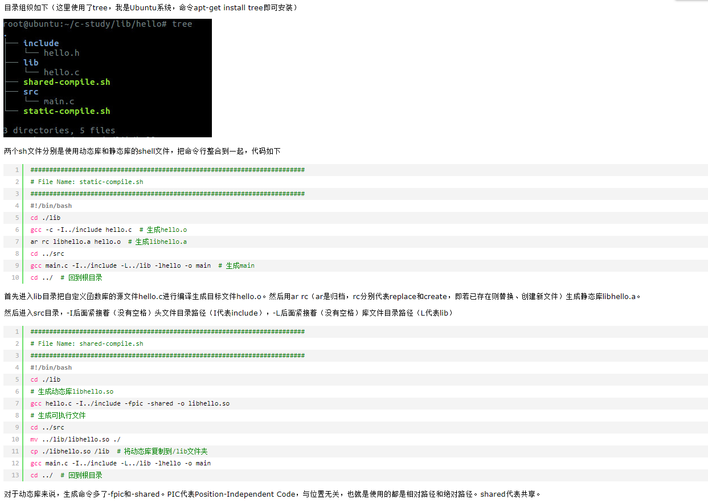

加头文件的链接方法，可以参考一下：

链接静态/动态的统用方法：

    gcc test.c -o test -I. -L. -ladd