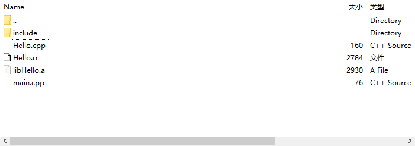

# Linux下的静态库与动态库生成与使用 #
linux下的静态库和动态库都是由.o文件生成的

**静态库** 

静态库文件名的命名方式是“libxxx.a”,库名前加”lib”，后缀用”.a”，“xxx”为静态库名。 

链接时间： 静态库的代码是在编译过程中被载入程序中。 

链接方式：静态库的链接是将整个函数库的所有数据都整合进了目标代码。这样做优点是在编译后的执行程序不在需要外部的函数库支持，因为所使用的函数都已经被编进去了。缺点是，如果所使用的静态库发生更新改变，你的程序必须重新编译。

**动态库** 
动态库的命名方式与静态库类似，前缀相同，为“lib”，后缀变为“.so”。所以为“libmytime.so” 

链接时间：动态库在编译的时候并没有被编译进目标代码，而是当你的程序执行到相关函数时才调用该函数库里的相应函数。这样做缺点是因为函数库并没有整合进程序，所以程序的运行环境必须提供相应的库。优点是动态库的改变并不影响你的程序，所以动态函数库升级比较方便。

它们两个还有很明显的不同点：当同一个程序分别使用静态库，动态库两种方式生成两个可执行文件时，静态链接所生成的文件所占用的内存要远远大于动态链接所生成的文件。（因为静态链接是在编译时将所有的函数都编译进了程序。而动态链接是在运行是才调用库里相应函数）

**静态链接库的一个缺点是，如果我们同时运行了许多程序，并且它们使用了同一个库函数，这样，在内存中会大量拷贝同一库函数。这样，就会浪费很多珍贵的内存和存储空间。使用了共享链接库的Linux就可以避免这个问题。**

## 静态库的生成与使用 ##
**1.文件结构**

**2.文件代码**

头文件Hello.h

    #ifndef CLIONCODE_HELLO_H
    #define CLIONCODE_HELLO_H
    void Hello();
    #endif //CLIONCODE_HELLO_H

实现文件Hello.cpp

    #include "./include/Hello.h"
    #include <iostream>
    
    void Hello() {
    	std::cout << "hello this is lib" << std::endl;
    }

主程序main.cpp

	#include <iostream>
	#include "./include/Hello.h"
	int main() {
	    Hello();
	}

**3.操作过程**

首先现在Clion下面用WSL编译环境跑一边上面的程序，能够编译通过后，将它们由SSH拷贝在WSL下，形成这样的结构(.o .a是后来运行出来的先不用管)

**4.shell命令**

**生成.a静态库**

首先使用`g++ -c -o Hello.o Hello.cpp`，因为无论静态库还是动态库都是由.o文件生成的，所以将Hello.cpp通过 -c的方式编译成Hello.o（编译汇编成目标代码而不链接）

接着使用`ar cr libHello.a Hello.o`，生成静态库libHello.a（注意：静态库文件的生成名称由讲究，必须是lib+文件名）

**使用.a静态库**

使用`g++ -o main main.cpp -static -lHello -L.`将静态库编译进去 （-static可以不加 **标准写法**）

-static :表示程序的静态链接

-lHello：链接静态库Hello.a

-L. :链接时需指明静态库所存在的路径，‘.’表示当前路径

--------------------------2019.4.28更新

1.静态库一定要放在生成文件后面

     g++ -o main main.cpp libHello.a

2.使用静态库时一定要连接所有用到的静态库

    gcc main.c -o main liba.a libb.a libc.a

a依赖于b, b依赖于c; 注意多个连接静态库的顺序 规则：越底层的库放在越后面

3.静态库动态库相结合使用

    gcc main.c –L/usr/local/lib –lworld –o main liba.a

其中–L/usr/local/lib为动态库路径 -lworld表示链接libworld.so动态库

**生成的文件**

**运行./main**

（静态库是在编译阶段就进入然后链接成为可执行代码，所以删掉libHello.a并不会影响main的运行结果）

静态库的更新
比如有一个新的.o文件需要链接到静态库里面去，`ar cr libHello.a Hello1.o`,链接完以后需要`ranlib libHello.a` 在静态库中更新索引
## 动态库的生成与使用 ##

最主要的是GCC命令行的一个选项: 
-shared 该选项指定生成动态连接库（让连接器生成T类型的导出符号表，有时候也生成弱连接W类型的导出符号），不用该标志外部程序无法连接。相当于一个可执行文件 
-fPIC：表示编译为位置独立的代码，不用此选项的话编译后的代码是位置相关的所以动态载入时是通过代码拷贝的方式来满足不同进程的需要，而不能达到真正代码段共享的目的。（转者注：共享库各段的加载地址并没有定死，可以加载到任意位置，因为指令中没有使用绝对地址（相对于链接后的可执行文件各segment来说），因此称为位置无关代码） 
-L.：表示要连接的库在当前目录中 
-ltest：编译器查找动态连接库时有隐含的命名规则，即在给出的名字前面加上lib，后面加上.so来确定库的名称

## 生成动态库 ##

1.生成.o文件 

    g++ -c -o Hello.o Hello.cpp -fpic  
或者**正规写法** `g++ -c -shared -fPIC -o Hello.o Hello.cpp`
注意这里在生成.o文件的时候先使用 -fpic （动态连接库中用到的object文件必须是用 "-fPIC"选项编译产生的，否则连接时要么报错，要么被忽略。）

或

2.生成.so动态库文件

	g++ -shared -o libHello.so Hello.o   
这样**正规写法**也行

	g++ -fpic -shared -o libHello.so Hello.o

简便写法：

	g++ -fpic -shared -o libHello.so Hello.cpp

## 重要知识点： ##

1.当一个程序使用共享函数库时，在连接阶段并不把函数代码连接进来，而只是链接函数的一个引用。当最终的函数导入内存开始真正执行时，函数引用被解析，共享函数库的代码才真正导入到内存中。这样，共享链接库的函数就可以被许多程序同时共享，并且只需存储一次就可以了。共享函数库的另一个优点是，它可以独立更新，与调用它的函数毫不影响。

2.“PIC”命令行标记告诉GCC产生的代码不要包含对函数和变量具体内存位置的引用，这是因为现在还无法知道使用该消息代码的应用程序会将它连接到哪一段内存地址空间。这样编译出的add.c可以被用于建立共享链接库。建立共享链接库只需要用GCC的”-shared”标记即可。
## 使用动态库 ##

1.链接并使用动态库
	g++ -o main main.cpp -lHello -L.

链接使用的方式和静态库一致  -lHello 表示链接 libHello.so   
-L.表示在当前路径下寻找库(当同时有动态和静态库时，优先链接动态库)

2.运行链接后的./main 

报错：

	./main: error while loading shared libraries: libHello.so: cannot open shared object file: No such file or directory

3.修正

因为进行动态链接时，程序并不会在当前目录中寻找动态库，而是会在/usr/lib目录下寻找，所以我们将动态库libHello.so移动到/usr/lib下就可以了。（在root权限下）

这里使用的是cp  `sudo cp libHello.so /usr/lib`，mv也行`sudo mv libHello.so /usr/lib`

既然连接器会搜寻`LD_LIBRARY_PATH`所指定的目录，那么我们可以将这个环境变量设置成当前目录：
**[慎用]** `export LD_LIBRARY_PATH=$(pwd)`

4.运行

5.比较文件大小
使用ls -lh main 

**动态库生成的可执行文件大小**8.5K

**静态库生成的可执行文件大小**2.2M 远远大于动态库的可执行文件(libHello.so也只有8.4K)

附：

**查看动态库的调用过程：**
ldd main

		linux-vdso.so.1 (0x00007fffe6d56000)
        libHello.so => /usr/lib/libHello.so (0x00007f8b58e00000)
        libstdc++.so.6 => /usr/lib/x86_64-linux-gnu/libstdc++.so.6 (0x00007f8b58a70000)
        libc.so.6 => /lib/x86_64-linux-gnu/libc.so.6 (0x00007f8b58670000)
        libm.so.6 => /lib/x86_64-linux-gnu/libm.so.6 (0x00007f8b582d0000)
        /lib64/ld-linux-x86-64.so.2 (0x00007f8b59400000)
        libgcc_s.so.1 => /lib/x86_64-linux-gnu/libgcc_s.so.1 (0x00007f8b580b0000)

部分编译参数：

-lHello：编译器查找动态连接库时有隐含的命名规则，即在给出的名字前面加上lib，后面加上.so来确定库的名称

`LD_LIBRARY_PATH`：这个环境变量指示动态连接器可以装载动态库的路径。

## shell命令生成和使用lib/dll ##

加头文件的链接方法，可以参考一下：

链接静态/动态的统用方法：

    gcc test.c -o test -I. -L. -ladd

附录：

静态库ar命令 参数 

    d：从库中删除模块。按模块原来的文件名指定要删除的模块。如果使用了任选项v则列出被删除的每个模块。
    m：该操作是在一个库中移动成员。当库中如果有若干模块有相同的符号定义(如函数定义)，则成员的位置顺序很重要。如果没有指定任选项，任何指定的成员将移到库的最后。也可以使用'a'，'b'，或'i'任选项移动到指定的位置。
    p：显示库中指定的成员到标准输出。如果指定任选项v，则在输出成员的内容前，将显示成员的名字。如果没有指定成员的名字，所有库中的文件将显示出来。
    q：快速追加。增加新模块到库的结尾处。并不检查是否需要替换。'a'，'b'，或'i'任选项对此操作没有影响，模块总是追加的库的结尾处。如果使用了任选项v则列出每个模块。 这时，库的符号表没有更新，可以用'ar s'或ranlib来更新库的符号表索引。
    r：在库中插入模块(替换)。当插入的模块名已经在库中存在，则替换同名的模块。如果若干模块中有一个模块在库中不存在，ar显示一个错误消息，并不替换其他同名模块。默认的情况下，新的成员增加在库的结尾处，可以使用其他任选项来改变增加的位置。
    t：显示库的模块表清单。一般只显示模块名。
    x：从库中提取一个成员。如果不指定要提取的模块，则提取库中所有的模块。
    
    　　下面在看看可与操作选项结合使用的任选项：
    
    a：在库的一个已经存在的成员后面增加一个新的文件。如果使用任选项a，则应该为命令行中membername参数指定一个已经存在的成员名。
    b：在库的一个已经存在的成员前面增加一个新的文件。如果使用任选项b，则应该为命令行中membername参数指定一个已经存在的成员名。
    c：创建一个库。不管库是否存在，都将创建。
    f：在库中截短指定的名字。缺省情况下，文件名的长度是不受限制的，可以使用此参数将文件名截短，以保证与其它系统的兼容。
    i：在库的一个已经存在的成员前面增加一个新的文件。如果使用任选项i，则应该为命令行中membername参数指定一个已经存在的成员名(类似任选项b)。
    l：暂未使用
    N：与count参数一起使用，在库中有多个相同的文件名时指定提取或输出的个数。
    o：当提取成员时，保留成员的原始数据。如果不指定该任选项，则提取出的模块的时间将标为提取出的时间。
    P：进行文件名匹配时使用全路径名。ar在创建库时不能使用全路径名（这样的库文件不符合POSIX标准），但是有些工具可以。
    s：写入一个目标文件索引到库中，或者更新一个存在的目标文件索引。甚至对于没有任何变化的库也作该动作。对一个库做ar s等同于对该库做ranlib。
    S：不创建目标文件索引，这在创建较大的库时能加快时间。
    u：一般说来，命令ar r...插入所有列出的文件到库中，如果你只想插入列出文件中那些比库中同名文件新的文件，就可以使用该任选项。该任选项只用于r操作选项。
    v：该选项用来显示执行操作选项的附加信息。
    V：显示ar的版本。