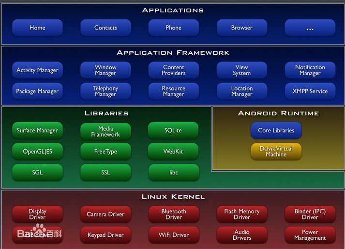

# 什么是Android #
## **Android是一种基于Linux的自由及开放源代码的操作系统 ##。
****主要使用于移动设备**，如智能手机和平板电脑，由Google（谷歌）公司和开放手机联盟领导及开发。尚未有统一中文名称，中国大陆地区较多人使用“安卓”或“安致”。Android操作系统最初由Andy Rubin开发，主要支持手机。

**Android 是运行于Linux kernel之上**，但并不是GNU/Linux。
Android 的 Linux kernel控制包括安全（Security），存储器管理（Memory Management），程序管理（Process Management），网络堆栈（Network Stack），驱动程序模型（Driver Model）等。下载Android源码之前，先要安装其构建工具 Repo来初始化源码。Repo 是 Android 用来辅助Git工作的一个工具。

## 知识体系 ##
1、Unix/Linux平台技术：基本命令，Linux下的开发环境

2、企业级数据库技术：SQL语言、SQL语句调优、Oracle数据库技术

3、Java 语言核心技术：Java语言基础、Java面向对象编程、JDK核心API、Java集合框架、Java网络编 程、JavaI/O编程、Java多线程编程、Java异常机制、Java安全、JDBC、XML

4、软件工程和设计模式：软件工程概述、配置管理及SVN、UML、基本设计模式

5、Android应用开发基础：Android开发平台、Eclipse+ADT开发环境、AVD及传感模拟器调试、Android核心组件、Android常用组件、Android高级组件、文件及网络访问、SQLite数据库编程、后台服务编程

6、互联网核心技术： HTML、CSS、JavaScript、JQuery、Ajax应用

7、Android高级应用开发：音频\视频\摄像头、互联网应用、GPS和位置服务、Google Map、2D\3D绘制、传感器开发、游戏开发、电话及SMS服务、网络\Bluetooth\Wi-Fi等。

8、Android系统级开发：移植、驱动、NDK（C方向）。

9、JavaEE核心技术：Servlet核心技术、JSP核心技术、Struts、Spring、Hibernate框架。

