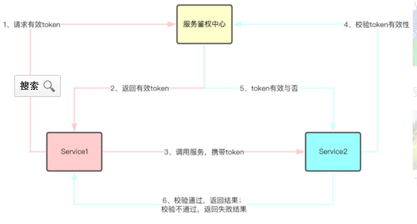

# 什么是鉴权 #

鉴权（authentication）是指验证用户是否拥有访问系统的权利。

鉴权包括两个方面：

用户鉴权，网络对用户进行鉴权，防止非法用户占用网络资源。

网络鉴权，用户对网络进行鉴权，防止用户接入了非法的网络，被骗取关键信息。

这种双向的认证机制，就是AKA鉴权。

## HTTP 请求鉴权 ##
HTTP 请求鉴权

每一个流管理请求均需在 HTTP 请求头部增加一个 Authorization 字段，其值为符合管理凭证的字符串，形式如下：

	Authorization: <QiniuToken>

<QiniuToken>: 管理凭证，用于鉴权。

	// 构造待签名的 Data
	// 1. 添加 Path
	data = "<Method> <Path>"
	// 2. 添加 Query，前提: Query 存在且不为空
	if "<RawQuery>" != "" {
	        data += "?<RawQuery>"
	}
	// 3. 添加 Host
	data += "\nHost: <Host>"
	// 4. 添加 Content-Type，前提: Content-Type 存在且不为空
	if "<Content-Type>" != "" {
	        data += "\nContent-Type: <Content-Type>"
	}
	// 5. 添加回车
	data += "\n\n"
	// 6. 添加 Body，前提: Content-Length 存在且 Body 不为空，同时 Content-Type 存在且不为空或 "application/octet-stream"
	bodyOK := "<Content-Length>" != "" && "<Body>" != ""
	contentTypeOK := "<Content-Type>" != "" && "<Content-Type>" != "application/octet-stream"
	if bodyOK && contentTypeOK {
	        data += "<Body>"
	}
	// 计算 HMAC-SHA1 签名，并对签名结果做 URL 安全的 Base64 编码
	sign = hmac_sha1(data, "Your_Secret_Key")
	encodedSign = urlsafe_base64_encode(sign)  
	// 将 Qiniu 标识与 AccessKey、encodedSign 拼接得到管理凭证
	<QiniuToken> = "Qiniu " + "Your_Access_Key" + ":" + encodedSign

URL 安全的 Base64 编码

    GET /v2/hubs/PiliSDKTest/streams/Y2FydGVyMjAwMA== HTTP/1.1
    Host: pili.qiniuapi.com
    User-Agent: pili-sdk-go/v2 go1.6 darwin/amd64
    Authorization: Qiniu 7O7hf7Ld1RrC_fpZdFvU8aCgOPuhw2K4eapYOdII:PGTUV-oRxWAIl6mdneJPSJieyyQ=
    Content-Type: application/x-www-form-urlencoded
    Accept-Encoding: gzip

鉴权（authentication）是指验证用户是否拥有访问系统的权利。传统的鉴权是通过密码来验证的。这种方式的前提是，每个获得密码的用户都已经被授权。在建立用户时，就为此用户分配一个密码，用户的密码可以由管理员指定，也可以由用户自行申请。这种方式的弱点十分明显：一旦密码被偷或用户遗失密码，情况就会十分麻烦，需要管理员对用户密码进行重新修改，而修改密码之前还要人工验证用户的合法身份。为了克服这种鉴权方式的缺点，需要一个更加可靠的鉴权方式。目前的主流鉴权方式是利用认证授权来验证数字签名的正确与否。逻辑上，授权发生在鉴权之后，而实际上，这两者常常是一个过程。

https://blog.csdn.net/wang839305939/article/details/78713124/

