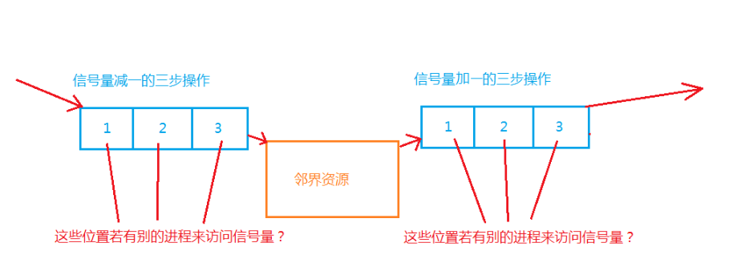

Linux进程通信之二元信号量

信号量的概念：

　　Linux中，基于system V的进程间通信还有二元信号量的通信方式，但严格意义上来说，信号量并不具备数据交换的功能，它本质是一把数据操作锁。通过控制其他的通信资源（⽂件，外部设备）来实现进程间通信，它本⾝只是⼀种外部资源的标识。信号量在此过程中负责数据操作的互斥、同步等功能。

一、为什么要使⽤信号量

　　为了防⽌出现因多个程序同时访问⼀个共享资源⽽引发的⼀系列问题，我们需要⼀种⽅法，它可以通过⽣成并使⽤令牌来授权，在任⼀时刻只能有⼀个执⾏线程访问代码的临界区域。临界区域是指执⾏数据更新的代码需要独占式地执⾏。⽽信号量就可以提供这样的⼀种访问机制，让⼀个临界区同⼀时间只有⼀个线程在访问它， 也就是说信号量是⽤来调协进程对共享资源的访问的。其中共享内存的使⽤就要⽤到信号量。

二、信号量的原理

　　消息队列就是通过两个进程访问一块内核中的公共资源，而产生的的进程间通信，但是，若是在访问这块公共资源时，二者没有互斥与同步机制，那么必然会造成对 公共资源的访问出现问题。 
　　

## 何为同步与互斥 ##

互斥：

　　假如现在有只有一台电脑，而有两个以上的人需要使用电脑，那么实际情况应该怎么分配呢？很明显，只能等一个人使用完之后，另一个人再使用。为了不被人打扰，前一个人在使用的时候，给旁边立个牌子，写上：正在使用，请勿打扰。然后第二个人就一直在等（在进程中就是阻塞式等待）。现在的重点在这块牌子上，这就保证了二者没有同一时间使用，而不会引发二个人的冲突。这就是互斥机制。

同步：

　 那假如前一个人一次只使用两分钟，或更短时间，每次结束后，第二个人刚准备去使用电脑，前一个人又重新坐下，反复这个动作，第二个人就无法使用，但是在互斥机制上也完全符合规则。同步机制就在于解决将这种情况，只要前一个人起身，不使用电脑了，那么就只能重新排队，换下一个人使用。

　　同样，在进程中，也是如此，我们不妨把两个人的角色改为两个进程，那个电脑作为公共资源，则完全符合我们对于进程的认识。 
　　所以，信号量就相当于一个第三方的同步互斥机制来保护一块公共资源，因为两个进程都可以看到信号量，那么信号量也是一个公共资源，则我们必须保证信号量的原子操作。防止在信号量的访问中，另外有进程来访问信号量，更改信号量的值，而造成第二个进程执行完后返回第一个进程造成的信号量的变化而导致的对于公共资源（邻界资源）的保护失效。我们可以假设此时只有一份邻界资源，那么信号量的值为1时代表可用，为0时代表邻界资源正在有进程使用。 
　　当为1时，有进程来需要使用这个邻界资源，那么要对信号量减一将其变为0，而减一的操作并不是一步执行的。而是由cpu从内存读入1到寄存器中，再对1减一，最后再将减完的1（即0），写入到内存中，可见，有三步操作。而不论在任何一步中还有进程对信号量进行操作，必然导致问题。 

