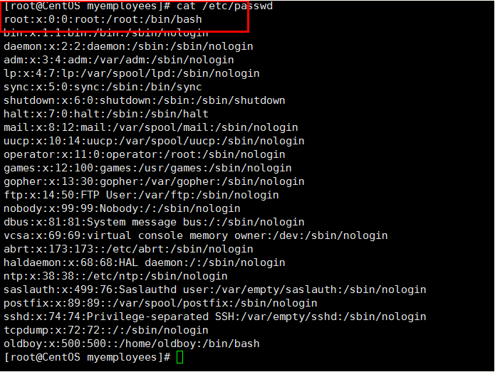

# UID和GID #

一、UID（User Identify）中文用户ID,相当于身份证一样，在系统中是唯一的。

用户分类

centos6

超级用户 UID=0 root

普通用户 UID=500起 oldboy

虚拟用户 UID=1-499 存在满足文件或者服务启动的需要。一般不需要登录;（傀儡） 

centos7

超级用户 UID=0 root

普通用户 UID=1001起 

虚拟用户 UID=1-1000 存在满足文件或者服务启动的需要。一般不需要登录;（傀儡）

root：（账号名称）：x（：账号密码）：0（：账号UID）：0（：账号GID）：root（：用户说明）：/root（：用户家目录）：/bin/bash（：shell解析）

1、账号名称：和用户UID对应，这是用户登录时使用的账号名称，在系统中是唯一的，不能重复。

2、账号密码：早期的Unix系统中，该字段是存放账号密码的，由于安全原因，后来把这个密码字段内容移动到/etc/shadown中，这里可以看到一个字母表示该用户密码在/etc/shadown中保护

3、账户UID：账号UID一般由一个整数表示的，范围是0~65535。

4、账户GID：账号GID一般也是由一个整数表示的，范围是0~65535，当添加账户时，默认情况下会同时建立一个与用户同名且UID和GID相同的组。

5、用户说明：这个字段是对这个账号二队描述说明。

6、用户家目录：用户登录后首先进入的目录，一般为（/home/用户名）这样的目录

7、shell解析器：当前用户登录后所使用的shell，在centos/rhel等linux中，默认的shell为bash，就是在这里设置的。如果不希望用户登录系统，可以用个usermod或者手工修改passwd配置，将该字段改为/sbin/nologin即可。如果仔细看passwd文件，会发现大部分内置系统虚拟账号的这个字段都是/sbin/nologin，表示禁止登录系统，这是出于安全考虑的。（echo $SHELL及cat /etc/shells）。