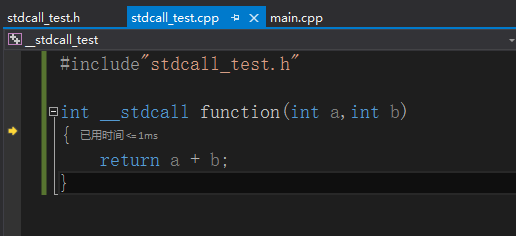

# C++知识回顾之__stdcall、__cdcel和__fastcall三者的区别 #

被这个关键字修饰的函数，其参数都是从右向左通过堆栈传递的(__fastcall 的前面部分由ecx,edx传)， 函数调用在返回前要由被调用者清理堆栈。

`__stdcall`表示

1.参数从右向左压入堆栈

2.函数被调用者修改堆栈

3.函数名(在编译器这个层次)自动加前导的下划线，后面紧跟一个@符号，其后紧跟着参数的尺寸

在win32应用程序里,宏APIENTRY，WINAPI，都表示_stdcall，非常常见。

而在编译时，这个函数的名字被翻译成_function@8 