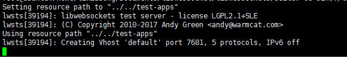
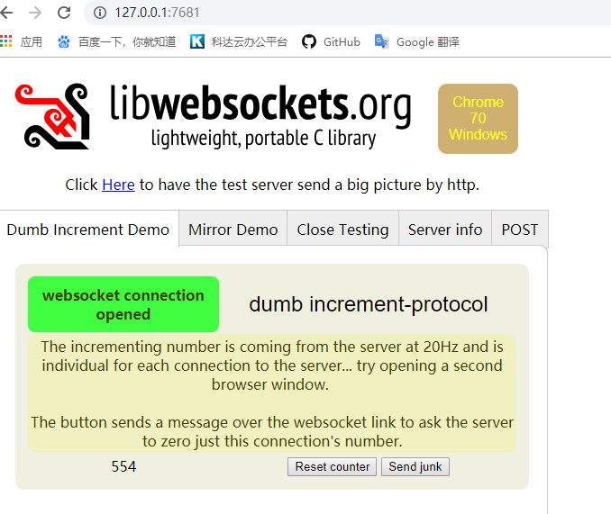
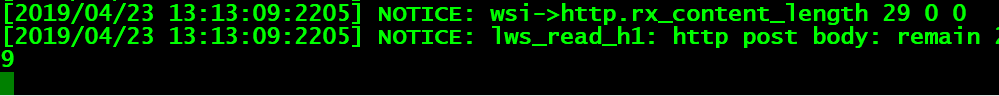

# libwebsockets（一）简介 #

libwebsockets是一款轻量级用来开发服务器和客户端的C库。按照官方（https://libwebsockets.org/）给出的介绍来看，它不仅支持**ws**，**wss**还同时支持http与https，可以轻轻松松结合openssl等库来实现ssl加密。

##下载
自己创建一个文件夹mkdir websocket 

	git clone https://github.com/warmcat/libwebsockets.git

##编译
为了可以进行多平台编译，websockets项目采用CMake作为编译工具，所以如果机器上没有CMake需要去安装CMake，以ubuntu为例。

到官网https://cmake.org/download/下载最新版本的CMake源码；

解压后进入源码根目录执行bootstrap；

然后进行编译make和安装sudo make install即可。

**1.CMake安装完成之后我们需要进入libwebsockets源码目录下的build目录，**

**2.创建build文件夹**

**3.cd build**

**4.cmake ..**

---------------------------------------
旧：没有安装openssl的需要先安装sudo apt install openssl

    cmake .. -DLWS_WITH_HTTP2=1 -DLWS_OPENSSL_INCLUDE_DIRS=/usr/local/include/openssl -DLWS_OPENSSL_LIBRARIES="/usr/local/lib64/libssl.so;/usr/local/lib64/libcrypto.so"
即开始源码的编译。执行完毕后将在build目录下生成文件，最后再build目录下执行make和make install命令即可完成编译安装。详细的编译选项和命令可以参见编译指导READMEs/README.build.md。

若：#include<openssl/ssl.h>后编译报错：openssl/ssl.h：没有那个文件或目录的解决办法

解决办法为： sudo apt-get install libssl-dev build-essential zlibczlib-bin libidn11-dev libidn11

安装上边的依赖就好了。（测试以后未奏效）

可以先查找 /usr/local/include和/usr/include，看里面是否i有openssl文件夹。

如果没有 ，继续安装

sudo apt-get install libssl-dev 

-----------------------

新：没有安装openssl的需要先安装sudo apt install openssl

可以先查找 /usr/local/include和/usr/include，看里面是否i有openssl文件夹。

如果没有 ，继续安装

依赖sudo apt-get install libssl-dev 

然后：

**1.CMake安装完成之后我们需要进入libwebsockets源码目录下的build目录，**

**2.创建build文件夹**

**3.cd build**

**4.cmake ..**

**5.make**

**6.sudo make install**
##测试

在编译完成后，build/bin目录下将会生成一些学习用的样例，我们以libwebsockets-test-server为例来看看libwebsockets运行起来是什么样的。

首先执行./libwebsockets-test-server --help查看如何使用该可执行文件:

	可选指定端口，支持ssl，日志文件与服务器资源目录
	Usage: test-server [--port=
] [--ssl] [-d <log bitfield>] [--resource_path <path>]

这里测试用的服务器资源目录已经安装在/usr/local/share/libwebsockets-test-server/目录下，默认即可。

	./libwebsockets-test-server

执行完之后我们看到服务器已经开始运行在7681端口。

访问该网址和端口即可查看最终的效果（不要使用ie浏览器）。

发送文字

client:

sever:

