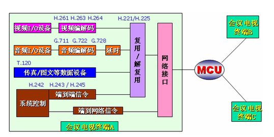

# 基于SIP的视频会议系统结构和原理 #

前言: 近几年来，随着计算机技术、通信技术和互联网技术的飞速发展，视频会议的应用范围正逐渐从传统的专业领域、大型企业等高端用户向中小企业等普通用户和个人用户拓展。据有关机构的分析结果显示，2004年我国视频会议市场的规模已经达到18.7亿元，并以每年26%的速度递增，市场前景十分广阔。

本文主要介绍了一种基于SIP的集中式视频会议模型，并根据此模型设计了初步的实现方案，分析了此方案的工作原理。目前，IETF领导的对SIP会议模型的研究还处于草案阶段，并没有成为标准，因此，对SIP会议框架及其实现技术的研究具有一定的理论和实践意义。

一、视频会议系统的主流技术标准 

　　目前，视频会议系统的主流技术标准有2个，H.323和SIP[1]。前者是由ITU-T SG16定义，包括H.225呼叫控制信令和RAS信令、H.245媒体控制信令和H.450补充业务信令规范；后者由IETF MMUSIC工作组定义，包括SDP媒体描述规范。

　　H.323系统沿用传统电信网的设计理念，兼顾传统PSTN呼叫流程和IP网特点而发展成熟，吸取了许多电信网的组网、互联和运营经验，能与PSTN网、窄带视频业务以及其他数据业务和应用网互联互通，近年来得到了广泛的应用，尤其是在组建VoIP大网方面凸现了其技术优势。H.323协议范围广，涵盖了各种独立设备、个人计算机技术以及点对点和点对多点的视频会议，该协议解决了视频会议中呼叫与会话控制、多媒体与带宽管理等许多问题。也正是因为H.323系统在设计的时候考虑的问题太多，整个体系结构显得庞大且较为复杂，限制了其在中小企业的部署。

SIP是用来建立、修改和终结多媒体会话的应用层控制协议，主要完成用户定位、用户能力交换、呼叫建立、呼叫处理等功能。它继承了互联网协议的设计理念，与H.323协议相比，具有简单灵活、扩展方便的特点，可方便地与其他互联网协议结合提供丰富的IP多媒体业务，以便在各种网络环境下部署。

　　目前，大规模商用VoIP网络和会议系统都采用H.323标准，但随着VoIP技术的进一步发展和视频会议系统应用的逐渐普及，SIP协议正日益受到业界的重视。3GPP已经确定将SIP协议作为第三代移动通信全IP网络的控制协议，制订了基于SIP的IP多媒体子系统（IMS）。业界也已经确定将SIP作为下一代网络（NGN）的核心控制协议。与此同时，SIP协议及其应用的标准化工作也在积极的进行之中，这其中就包括由IETF SIPPING工作组领导的集中式多媒体会议的标准化工作和XCON工作组领导的会场控制和CPCP（Conference Policy Control Protocol）的标准化工作。随着这些标准的制订，基于SIP的视频会议系统必将获得越来越广泛的应用。

二、集中式会议系统模型

　　下面介绍一种基于SIP的集中式会议模型。所谓集中式是指该模型相对于多播会议、全分布式会议等会议模型而言，具有信令集中控制、媒体集中处理的特点。该会议模型也是应用最广泛的一种情形。集中式会议模型的结构图[2]如图1所示。

　　该模型主要包括与会者（Participant）、会议控制中心（Focus）、会议策略服务器（CPS）、会议策略（CP）、会议通告服务（CNS）、媒体混合服务器（Mixer）等逻辑功能模块。其中，Focus、CPS、CNS、CP和Mixer构成会议服务器，完成多媒体会议的核心功能。此会议模型中各模块功能如下。

　　a）会议的控制中心：会议的控制中心与每个与会者之间存在SIP对话联系。它一方面根据会议成员策略管理整个会议，如会议接入控制、与会人员管理等，另一方面它又根据会议媒体策略，对媒体混合服务器进行控制，保证每个与会者能够接收到会议的媒体流。

　　每一个会议控制中心都有一个会议URI与其相对应，此URI在全局范围内是惟一的。当用户需要加入会议时，需向相应会议URI发送INVITE请求。

　　b）与会者：与会者是指会议中和会议控制中心维持SIP对话的SIP用户代理。此用户代理可以是PC应用程序、SIP电话或者是PSTN网关，也可以是其他会议控制中心。当与会者是其他会议的会议控制中心时，会议的拓扑结构是分级的，这种会议结构具有良好的可扩展性，所有区域性的子会议有单独的会议控制中心，这些会议控制中心再连接到主会议的会议控制中心上，进行分级控制和管理。

　　c）CPS：CPS是系统的逻辑功能模块，用来存储和操作会议策略，为用户和支配会议操作的会议策略之间提供接口。用户可以使用non-SIP方法和CPS交互，完成会议策略的制定、修改等操作。

　　d）CP：会议策略包含了支配会议控制中心进行会议操作的规则，一个会议对应一个会议策略，包括会议成员策略和会议媒体策略。会议成员策略主要用于会议成员的管理，包括用户接入控制、用户权限管理等。会议媒体策略用于会议媒体混合及分发的控制，包括媒体混合策略、同步策略、媒体分发策略等。用户可以通过Web方式或其他non-SIP方式对会议策略进行维护。

　　e）CNS：会议控制中心可以提供CNS功能，工作机制由RFC 3265[4]定义，主要完成向与会人员通知相应的会议事件和会议状态。与会者在加入会议后可向会议控制中心发送SUBSCRIBE请求，订阅会议事件和状态通知服务。会议通知服务器将通过NOTIFY消息定时向与会者通告预定的会议事件和会议状态。例如，用户可以预定会议成员的在席信息，当有与会者加入或退出会议时，会议通知服务器将向该用户发送会议成员变更的情况。

　　f）媒体混合服务器：媒体混合服务器负责完成会议媒体的混合和分发，接收者可以是会议的与会者或其他的媒体混合服务器。媒体流的混合处理由会议控制中心根据媒体策略进行直接或间接控制，处理过程因媒体流类型的不同而不同。

三、视频会议系统结构设计

　　根据前面介绍的会议模型以及多媒体会议的一般功能要求[3]，我们设计了一个视频会议系统的实现方案，系统结构如图2所示。

　　该系统由多媒体会议终端、会议管理服务器、会议控制服务器、媒体服务器和系统数据库5部分构成。呼叫服务器（CS）是SIP Proxy服务器，负责SIP消息的转发，并集成了注册服务器的功能。

　　下面分别介绍各组成部分的功能。

　　1）多媒体会议终端

　　多媒体会议终端是用户用来参加会议的桌面应用程序。会议终端启动时会发送REGISTER消息向注册服务器注册，注册成功后便保持在线状态，可以随时发起呼叫或接收呼叫请求。在加入会议后，可以发送SUBSCRIBE请求，预定会议状态信息报告，以便获得最新的会议状态变更情况。与会者可通过多媒体会议终端进行申请发言、释放申请、释放发言等操作。可以进行即时消息的发送和接收，实现会议文字聊天功能。

　　2）会议管理服务器

　　会议管理服务器在图2中对应为Web 服务器，主要完成通过Web界面管理会议的功能，包括会议的预定、修改和取消，会议策略的制定和修改等。另外，还可以通过会议管理服务器对会议控制服务器的系统参数进行配置，并提交到系统数据库保存。会议控制服务器在启动时可以从系统数据库将系统参数下载到本地，进行系统的初始化。

　　3）会议控制服务器

　　会议控制服务器是此系统的控制中心，模型中的会议控制中心功能，包括会议的创建、启动、删除、会场管理和控制、会议状态信息的采集和发布、会议成员的在席管理、处理会议成员请求等。会议控制服务器通过MEGACO/H.248[5]命令对媒体服务器的媒体混合处理进行控制。

　　会议控制服务器主要由总控模块、Web管理模块、启动/注册模块、即时会议模块、会议状态通告模块、会议控制模块和会议列表等几部分组成。其中总控模块主要负责系统的初始化工作和各个模块之间的通信调度等功能；启动/注册模块主要负责会议的启动和结束等操作；会议状态通告模块负责完成会议状态信息通知服务，遵从RFC3265标准；会议控制模块是会议控制服务器的主要功能模块，采用基于事件触发的工作机制。会议列表负责维护会议的状态信息，包括会议属性、成员列表、请求队列和消息队列等，并提供对这些数据进行操作的接口函数。

　　4） 媒体服务器

　　媒体服务器可采用纯软件方式实现媒体混合等处理，与传统的采用硬件板卡的方式相比，具有巨大的成本优势。会议控制服务器通过MEGACO/H.248命令控制媒体服务器，完成创建关联域、增加终端、删除终端、修改终端属性、删除关联域等操作。媒体服务器接收与会者发来的媒体流，按照媒体策略进行混合后，再分发给与会者，从而实现会议媒体流的交互。
四、视频会议系统工作原理

　　在介绍了集中式视频会议系统的结构之后，下面简单介绍此系统的工作原理。

　　4.1 创建会议

　　此系统支持预约式会议和即时会议2种会议类型。

　　预约式会议的创建可通过Web管理系统来完成。会议预定成功后，将向系统数据库的会议数据表插入一条记录。会议控制服务器的Web管理模块对系统数据库的会议数据表进行周期扫描，若发现新的会议记录，则按照预定要求生成新的会议节点，添加到会议列表中。

　　即时会议的创建可通过多媒体会议终端完成。用户只需向指定的会议工厂URI发送INVITE请求即可创建一个即时会议。新会议的URI由302响应的Contact头域带回。

　　4.2 加入会议

　　与会者可以通过以下5种方式加入到会议中：

　　a）Call-In方式。用户可通过E-mail、Web公告、即时消息等方式事先获得会议URI，然后向会议URI发送INVITE消息，请求加入会议。

　　b）Call-Out方式。会议开始后，会议控制中心向用户发送INVITE消息，邀请其加入会议。会议控制中心需事先存储与会者的URI列表。

　　c）第三方通过向会议URI发送REFER[6]请求，触发会议控制中心邀请用户加入会议。

　　d）第三方通过向用户发送REFER请求，触发用户主动加入会议。

e）若用户不知道会议URI，但可能通过其他途径获得会议中的某一个会话ID，则可通过发送带有Join头域的INVITE消息来加入会议[7]。

　　4.3 会议状态信息通告机制

　　与会者在会议进行期间可以获得会议的事件及状态信息，这通过会议通告服务（CNS）来实现。如图4中的F9－F12所示，与会者在加入会议后可向会议控制中心发送SUBSCRIBE请求。订阅感兴趣的会议事件和状态通知的服务，当某类事件发生或会议的状态发生变化时，会议通告服务器将生成状态报告的事件包，通过NOTIFY请求发送给订阅者，通告发生的事件或状态的变化情况。

　　4.4 会场控制机制

　　会场控制（Floor Control）是指对共享资源的访问控制，如对发言权、视频显示等公共资源的控制。会场控制消息是在会议主席、会议服务器和会议成员之间传递的，可分为2部分：会议控制命令和会议控制事件。会议控制命令是从会议主席或经过授权的会议参与者发往会议服务器的更改会场资源状态的请求。而会议控制事件消息是一种关于会场资源状态信息的报告，由会议服务器发往会议参与者。控制命令的内容可以是添加会场资源、请求使用会场资源、主席批准/拒绝请求或改变会议策略等。控制事件则用来向会议参与者报告有关会场资源占用情况的变化、会议策略或媒体配置的变更等情况。

　　会场控制命令采用SOAP格式封装[8]，由SIP协议的INFO[9]消息作为承载消息。会场控制事件消息的传送可以通过会议状态信息通告机制来实现。

　　4.5 结束会议

　　预约型会议的结束时间在预定时已经确定，当会议的结束时间到，但会议中仍有与会者时，则会议控制中心向其发送BYE消息并将其删除，然后执行去注册过程。去注册成功后，会议控制服务器将此会议节点删除。

　　即时会议因在创建时没有确定结束时间，故不能依据会议的结束时间来结束会议。即时会议判断结束的条件是会议中的与会者数目。当会议中的最后一个与会者退出会议后，认为会议结束，执行去注册过程，去注册成功后即删除会议节点。
五、结束语

　　目前，SIP多媒体会议的相关标准还在制定之中，相关技术的发展也很迅速，本系统所涉及的很多技术在实际应用中还需要进一步完善，尤其是会议策略控制技术、会场控制机制、会议级联、子会议系统、会议安全机制以及商用模式下的计费方案等方面。

　　用基于SIP和SOAP相结合的会场控制机制，采用基于MEGACO/H.248协议控制的纯软件媒体服务器，可实现级联会议、子会议系统等多种会议模式的媒体处理。该方案的实现对基于SIP的集中式视频会议的研究具有一定的实践和参考意义。

更多相关信息参见https://baike.baidu.com/item/%E8%A7%86%E9%A2%91%E4%BC%9A%E8%AE%AE%E7%B3%BB%E7%BB%9F/1383446

https://wenku.baidu.com/view/3142bc4d26fff705cc170af9.html