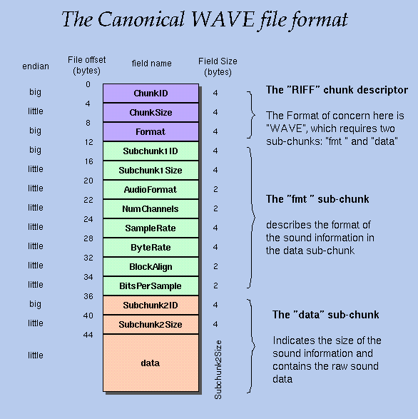

# 将PCM格式存储成WAV格式文件 #

前言：无论是文字，图像还是声音，都必须以一种特定的格式组织和存储起来，这样才能让显示器或播放器知道以怎样的一种方式去解析这些数据。

把PCM格式的数据存储成WAV格式数据的思路：先写头部，再写数据块。

WAV格式可以分成两个部分：

1.文件头，存储一些重要的参数信息，比如采样率，声道数，量化精度等等。

2.数据块，原始的PCM数据。

WAVE文件格式是Microsoft用于存储多媒体文件的RIFF规范的子集。 RIFF文件以文件头开头，后跟一系列数据块。 WAVE文件通常只是一个RIFF文件，其中包含一个“WAVE”块，它由两个子块组成 - 一个指定数据格式的“fmt”块和一个包含实际样本数据的“数据”块。

这里面提到了riff文件格式

RIFF格式简介：
Resource Interchange File Format（简称RIFF），资源交换文件格式，是一种按照标记区块存储数据（tagged chunks）的通用文件存储格式，多用于存储音频、视频等多媒体数据。Microsoft在windows下的AVI、ANI 、WAV等都是基于RIFF实现的。

##标准的音频文件格式

我们需要简单来说明一下这张图的结构：

可以分成三个部分：

第一部分RIFF :  
 
1.ChunkID 存储了“RIFF”字段，表示这是一个“RIFF”格式的文件。

2.ChunkSize 记录整个wav文件的字节数。

3.Format  存储了“WAVE”字段，表示这是一个wav文件。

第二部分fmt： 这部分的内容主要是记录一些关键参数，比如采样率，声道数，量化精度等等。

1.Subchunk1 ID      存储了“fmt”字段

2.Subchunk1 Size  存储“fmt”字段的长度

3.AudioFormat        存储 量化精度

4.Num Channels    存储声道数

5.SampleRate        存储采样率

6.ByteRate             存储比特率      SampleRate * NumChannels * BitsPerSample/8

7.BlockAlign           == NumChannels * BitsPerSample/8

8.BitsPerSample   每个采样点的bit数，8bits=8, 16bits=16

第三部分data ： 主要描述数据块

1.Subchunk2 ID     存储“data”字段

2.Subchunk2Size   记录存储的二进制原始音频数据的长度

3.data   存储二进制原始音频数据

详细见：
https://blog.csdn.net/u012173922/article/details/78849076

https://www.cnblogs.com/Allen-win/p/9940242.html