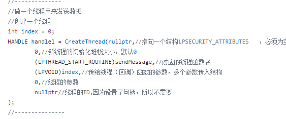

关于windows的socket编程

看到WSAStartup与WSACleanup函数

因为观察到在windows的socket编程中有WSAStartup(),WSACleanup()两个函数，

WSAStartup应该与WSACleanup成对使用，WSAStartup的功能是初始化Winsock DLL，WSACleanup是来解除与Socket库的绑定并且释放Socket库所占用的系统资源。

在Windows下，Socket是以DLL的形式实现的。在DLL内部维持着一个计数器，只有第一次调用WSAStartup才真正装载DLL，以后的 调用只是简单的增加计数器，而WSACleanup函数的功能则刚好相反，每调用一次使计数器减1，当计数器减到0时，DLL就从内存中被卸载！因此，你 调用了多少次WSAStartup，就应相应的调用多少次的WSACleanup.

WSAStartup()函数必须是应用程序或DLL调用的第一个Windows Sockets函数.

线程的创建

其中LPVOID可以理解为void*
线程函数的运行

其实socket可以理解为服务器端和客户端同时连向socket管道，然后在管道中进行通信