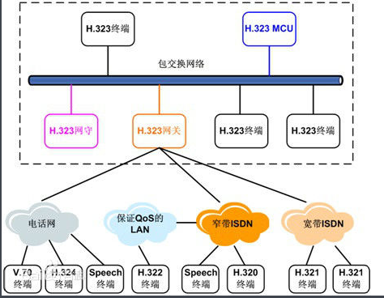
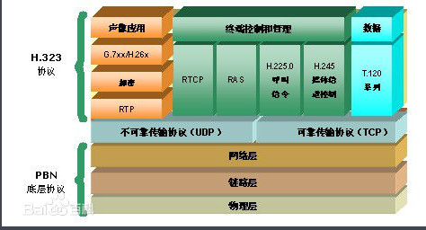
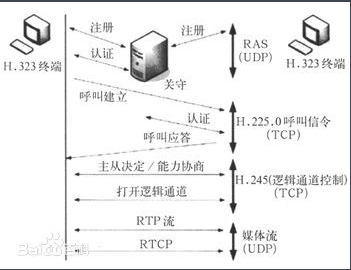

# H.323协议 #

在传统电话系统中，一次通话从建立系统连接到拆除连接都需要一定的信令来配合完成。同样，在IP电话中，如何寻找被叫方、如何建立应答、如何按照彼此的数据处理能力发送数据，也需要相应的信令系统，一般称为协议。在国际上，比较有影响的IP电话方面的协议包括ITU-T提出的H.323协议和IETF提出的SIP协议，本节主要介绍用得最广泛H.323协议。

H.323规定的视频会议系统结构如下图所示，其中虚线框的内容为H.323协议内的内容。

## H.323体系架构 ##

H.323终端：终端提供了在点对点或者多点会议中音视频、数据和信令的通信能力。

H.323 MCU：MCU可以分解为MC（Multipoint Controller，多点控制器）和MP（Multipoint Processor，多点处理器），其中MC处理多点的信令，MP负责多点通信的媒体处理。

H.323网关：是H.323系统中的一个可选组件。网关最重要的作用就是协议转换。通过网关，两个不同协议体系结构的网络就可以得以通信。例如，有了网关，一个H.323终端能够与PSTN终端语音通信。

H.323网守：主要负责认证控制、地址解析、带宽管理和路由控制等。当H.323网络中不存在网守时，两个端点是不需要经过认证就能直接通信的。但是这样不利于运营商开展计费服务、扩展新功能等。

## 协议结构 ##

H323基于TCP协议 而非IP协议

流程

详见：https://baike.baidu.com/item/H.323%E9%9F%B3%E8%A7%86%E9%A2%91%E5%8D%8F%E8%AE%AE/1340766?fr=aladdin

https://baike.baidu.com/item/H.323/1391803?fromtitle=H323&fromid=2174181&fr=aladdin