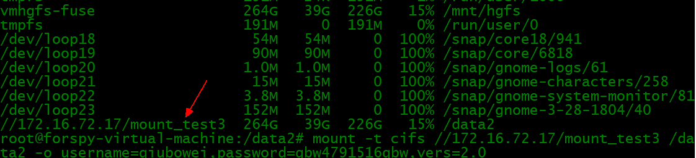
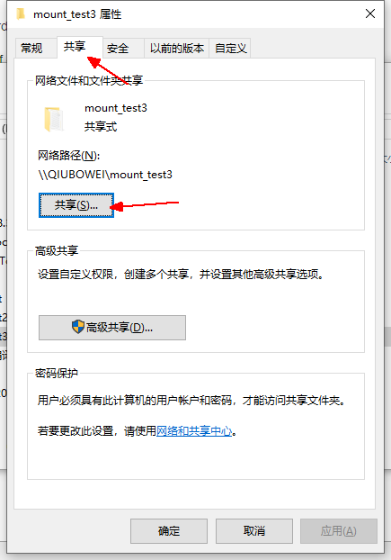
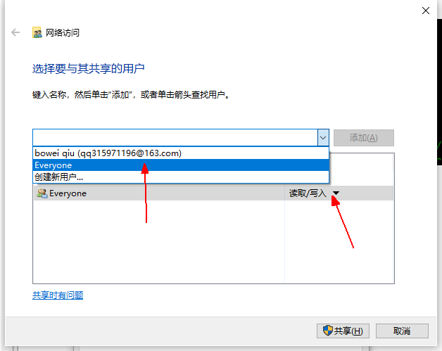
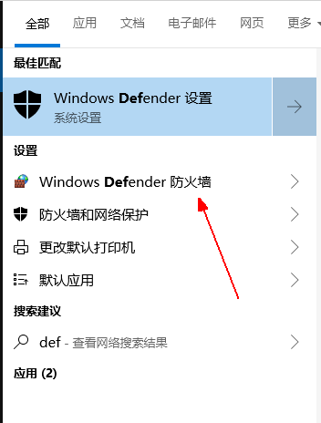

# Linux mount命令挂载系统文件 #

学习和了解以下mount命令

将文件夹设置为共享，权限为everyone

mount -t cifs //172.16.72.17/mount_test3 /data2 -o username=qiubowei,password=

注：//172.16.72.17为ip

mount_test3为本地Windows共享的文件夹 

/data2为要要挂载的位置

username为用户名

password为密码

输入：df -h 以后可以查看是否挂载成功

注：使用ipconfig/all 可以看到用户名

设置共享文件的方法：

修改读写权限

若mount不上可以尝试重启并关闭防火墙

在130上mount不上的时候可以试试夹vers

	sudo mount -t cifs //172.16.72.17/test_hehe /test1 -o username=qiubowei,password=qbw4791516qbw,vers=2.0

