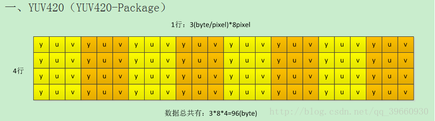
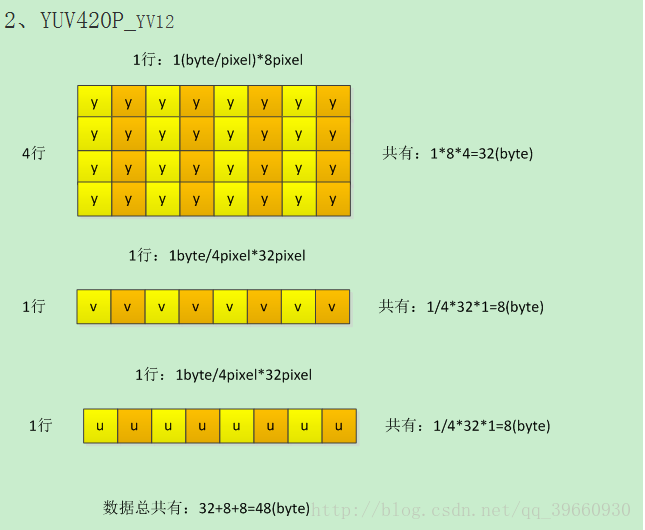
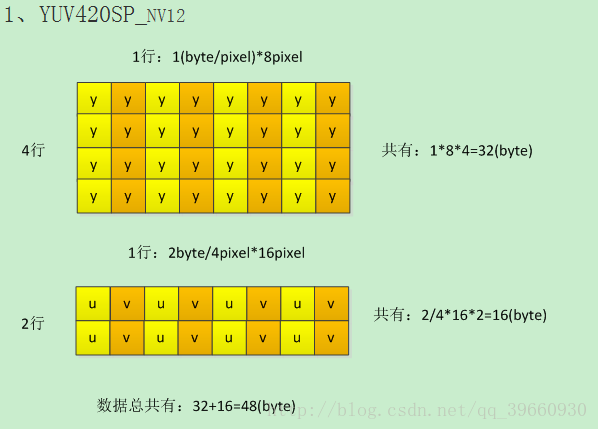
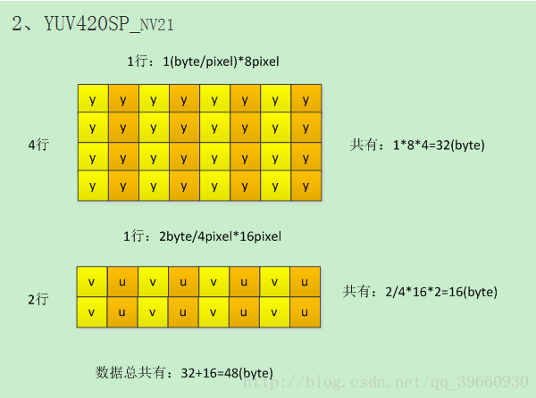

# yuv格式解析 #

YUV是指亮度参量和色度参量分开表示的像素格式。Y表示明亮度(Luminance, Luma)，U(Cb)和V(Cr)则是色度，浓度(Chrominance, Chroma)。

假设一个分辨率为8*4（w*h）的YUV图像，则内存分布如下： 
一、YUV420（YUV420-Package）

二、YUV420P（YUV420-Planar）

YUV420P-I420

YUV420P-YV12

三、YUV420SP（YUV420-Semeplanar）

YUV420SP_NV12

YUV420SP-NV21

